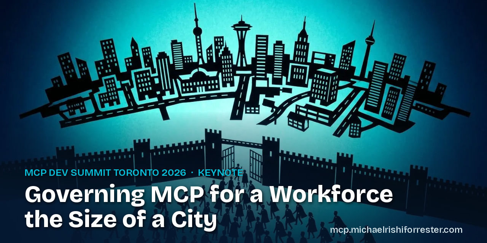

# MCP for a City

The resources behind **Governing MCP for a Workforce the Size of a City**, the
keynote Michael Rishi Forrester gave at MCP Dev Summit Toronto on Tuesday,
October 6, 2026. The talk is fifteen minutes on what happens when governance
meets people who route around a no. It concludes that the most effective lever
for governing MCP at this scale is a relationship with the users who consume
your MCP servers, and it closes on one line: talk to your users.

The interactive version lives at **[mcp.michaelrishiforrester.com](https://mcp.michaelrishiforrester.com/)**,
where you can walk an MCP server through the six approval gates and take the
checklist with you.

## Start here

| If you | Read |
|---|---|
| Run a platform team putting MCP in front of people | [The enterprise checklist for 2026-07-28](10-operating-mcp-at-scale-series/operating-mcp-checklist.md), then [the six approval gates](04-approval-gates-checklist/approval-gates.md) |
| Work in security | [Part two of the series, on vetting](10-operating-mcp-at-scale-series/part-2-security.md), then [the research behind the gates](06-research-and-source-ledger/approval-process-criteria.md) |
| Just saw the talk | [The slides](01-keynote-slides/governing-mcp-toronto-2026.pdf) and [the spoken script](02-spoken-script/keynote-spoken.md) |
| Want the long version | [Operating MCP at Scale](10-operating-mcp-at-scale-series/), five parts and the checklist |
| Want the short version | [The shadow-play film](03-shadow-play-film/), about six and a half minutes |

## What is here

The folders are numbered in the order the talk uses them.

| Folder | What it holds |
|---|---|
| [01-keynote-slides/](01-keynote-slides/) | The deck as delivered, as a PDF: the 39 slides shown |
| [02-spoken-script/](02-spoken-script/) | The spoken script, slide by slide, from the speaker notes of the deck as delivered |
| [03-shadow-play-film/](03-shadow-play-film/) | The shadow-play film of the talk: links to the narrated and captions-only cuts |
| [04-approval-gates-checklist/](04-approval-gates-checklist/) | The six approval gates as a checklist a platform team can use, with every verify step and source |
| [05-architecture-diagrams/](05-architecture-diagrams/) | The enterprise architecture diagram, as a PNG and its Mermaid source |
| [06-research-and-source-ledger/](06-research-and-source-ledger/) | The research behind the talk, by topic, and the source ledger for the gate and wrapping slides |
| [07-sources-slide/](07-sources-slide/) | The sources slide from the deck, as text with links |
| [08-shadow-play-art/](08-shadow-play-art/) | Every picture made for the talk, indexed by slide |
| [09-qr-codes/](09-qr-codes/) | The QR code from the closing slides |
| [10-operating-mcp-at-scale-series/](10-operating-mcp-at-scale-series/) | The five-part article series on running MCP at enterprise scale, and its checklist |

`06-research-and-source-ledger/` is the working material; `07-sources-slide/`
is only what appeared on the sources slide.

## How the claims are checked

The [source ledger](06-research-and-source-ledger/source-ledger.md) checks every
claim on the gate and wrapping slides, one row per claim, with its source, how it
was read and the date. Each article in the series ends with its own source list
and was checked by four independent reviews before publication. Specification
facts are stated against the 2026-07-28 revision.

## Related repos

- [mcp-city](https://github.com/peopleforrester/mcp-city): the source of the site
- [mcp-city-film](https://github.com/peopleforrester/mcp-city-film): the source of the film
- [mcp_best_practices](https://github.com/peopleforrester/mcp_best_practices): a security-first MCP portfolio tracking the 2026-07-28 revision
- [mcp-k8s-observability-argocd-server](https://github.com/peopleforrester/mcp-k8s-observability-argocd-server): an MCP server for Kubernetes observability through Argo CD
- [MCP_Server_Claude_Doc_monitor](https://github.com/peopleforrester/MCP_Server_Claude_Doc_monitor): an MCP server that watches documentation for change

## The person

Michael Rishi Forrester: [michaelrishiforrester.com](https://michaelrishiforrester.com/) ·
[Speaking](https://michaelrishiforrester.com/speaking/) ·
[LinkedIn](https://www.linkedin.com/in/michaelrishiforrester/) ·
[GitHub](https://github.com/peopleforrester) ·
[Email](mailto:michaelrishiforrester@gmail.com)

## A note on the art

The illustrations were generated for the talk in a cut-paper shadow-play style.
The ship outlines in `08-shadow-play-art/ships/` depict designs that belong to
their studios and are fan art made for a scale comparison, nothing more. The
cable sketches are hand-drawn.

## Citing this work

[CITATION.cff](CITATION.cff) carries the citation; GitHub's "Cite this
repository" button reads it.

## License

Text, research and generated art: [CC BY 4.0](LICENSE). Quoted sources remain
their authors'.
